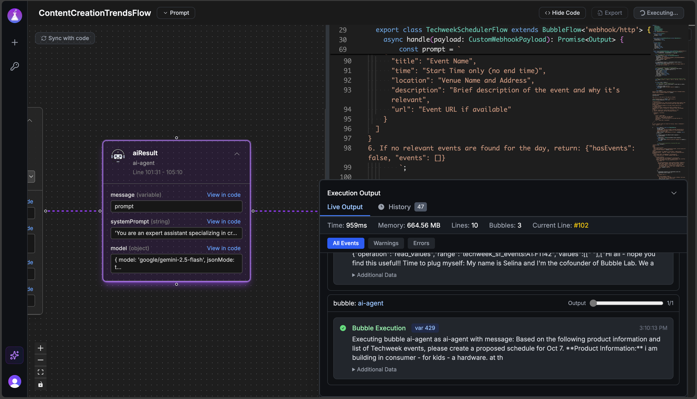

# BubbleLab

Open-source agentic workflow automation builder with full observability and exportability.

## 🚀 Quick Start

### 1. Hosted Bubble Studio (Fastest Way)

The quickest way to get started with BubbleLab is through our hosted Bubble Studio:

<!-- Insert screenshot here -->



**Benefits:**

- No setup required - start building immediately
- Visual flow builder with drag-and-drop interface
- Export your flows to run on your own backend
- Follow the in-studio instructions to integrate with your application

👉 [Try Bubble Studio Now](https://app.bubblelab.ai)
Currently closed-beta, if you want access email us at hello@bubblelab.ai

### 2. Create BubbleLab App

Get started with BubbleLab in seconds using our CLI tool:

```bash
npx create-bubblelab-app
```

This will scaffold a new BubbleLab project with:

- Pre-configured TypeScript setup with core packages and run time installed
- Sample templates (basic, reddit-scraper, etc.) you can choose
- All necessary dependencies
- Ready-to-run example workflows you fully control, customize

**Next steps after creation:**

```bash
cd my-agent
npm install
npm run dev
```

#### What You'll Get: Real-World Example

Let's look at what BubbleFlow code actually looks like using the **reddit-scraper** template:

**The Flow** (`reddit-news-flow.ts`) - Just **~50 lines** of clean TypeScript:

```typescript
export class RedditNewsFlow extends BubbleFlow<'webhook/http'> {
  async handle(payload: RedditNewsPayload) {
    const subreddit = payload.subreddit || 'worldnews';
    const limit = payload.limit || 10;

    // Step 1: Scrape Reddit for posts
    const scrapeResult = await new RedditScrapeTool({
      subreddit: subreddit,
      sort: 'hot',
      limit: limit,
    }).action();

    const posts = scrapeResult.data.posts;

    // Step 2: AI analyzes and summarizes the posts
    const summaryResult = await new AIAgentBubble({
      message: `Analyze these top ${posts.length} posts from r/${subreddit}:
        ${postsText}

        Provide: 1) Summary of top news, 2) Key themes, 3) Executive summary`,
      model: { model: 'google/gemini-2.5-flash' },
    }).action();

    return {
      subreddit,
      postsScraped: posts.length,
      summary: summaryResult.data?.response,
      status: 'success',
    };
  }
}
```

**What happens when you run it:**

```bash
$ npm run dev

✅ Reddit scraper executed successfully
{
  "subreddit": "worldnews",
  "postsScraped": 10,
  "summary": "### Top 5 News Items:\n1. China Halts US Soybean Imports...\n2. Zelensky Firm on Ukraine's EU Membership...\n3. Hamas Demands Release of Oct 7 Attackers...\n[full AI-generated summary]",
  "timestamp": "2025-10-07T21:35:19.882Z",
  "status": "success"
}

Execution Summary:
  Total Duration: 13.8s
  Bubbles Executed: 3 (RedditScrapeTool → AIAgentBubble → Return)
  Token Usage: 1,524 tokens (835 input, 689 output)
  Memory Peak: 139.8 MB
```

**What's happening under the hood:**

1. **RedditScrapeTool** scrapes 10 hot posts from r/worldnews
2. **AIAgentBubble** (using Google Gemini) analyzes the posts
3. Returns structured JSON with summary, themes, and metadata
4. Detailed execution stats show performance and token usage

**Key Features:**

- **Type-safe** - Full TypeScript support with proper interfaces
- **Simple** - Just chain "Bubbles" (tools/nodes) together with `.action()`
- **Observable** - Built-in logging shows exactly what's executing
- **Production-ready** - Error handling, metrics, and performance tracking included

## 📚 Documentation

**Learn how to use each bubble node and build powerful workflows:**

👉 [Visit BubbleLab Documentation](https://docs.bubblelab.ai/)

The documentation includes:

- Detailed guides for each node type
- Workflow building tutorials
- API references
- Best practices and examples

## 📦 Open Source Packages

BubbleLab is built on a modular architecture with the following core packages:

### Core Packages

- **[@bubblelab/bubble-core](./bubble-core)** - Core AI workflow engine
  - Visual workflow execution
  - LangChain/LangGraph integration
  - Built-in nodes for AI operations, data processing, and more
  - Support for multiple LLM providers (OpenAI, Google, Anthropic, etc.)

- **[@bubblelab/bubble-runtime](./bubble-runtime)** - Runtime execution environment
  - Execute BubbleLab workflows programmatically
  - Execution engine
  - Built-in tracing and observability

- **[@bubblelab/shared-schemas](./bubble-shared-schemas)** - Common type definitions and schemas
  - Shared Zod schemas for validation
  - TypeScript type definitions
  - OpenAPI schema generation

### Developer Tools

- **[@bubblelab/ts-scope-manager](./bubble-scope-manager)** - TypeScript scope analysis utilities
  - TypeScript AST analysis
  - Scope management for dynamic code execution

- **[create-bubblelab-app](./create-bubblelab-app)** - Project scaffolding CLI
  - Quick project setup
  - Multiple starter templates
  - Best practices baked in

## 🔨 Building from Source

**Coming Soon!**

## 🤝 Contributing & Self-Hosting Bubble Studio

Documentation for contributing to BubbleLab and self-hosting the platform is coming soon!

In the meantime, feel free to:

- Explore the source code
- Open issues for bugs or feature requests about Bubble Studio or add more bubbles
- Submit pull requests
- Join our community discussions

## License

Apache 2.0
